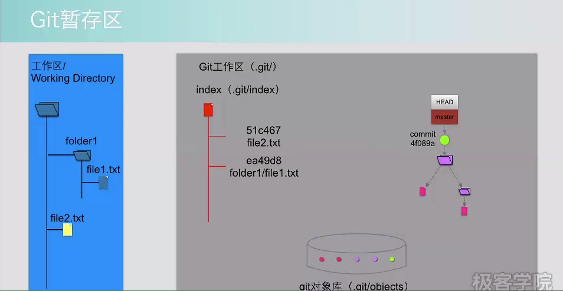
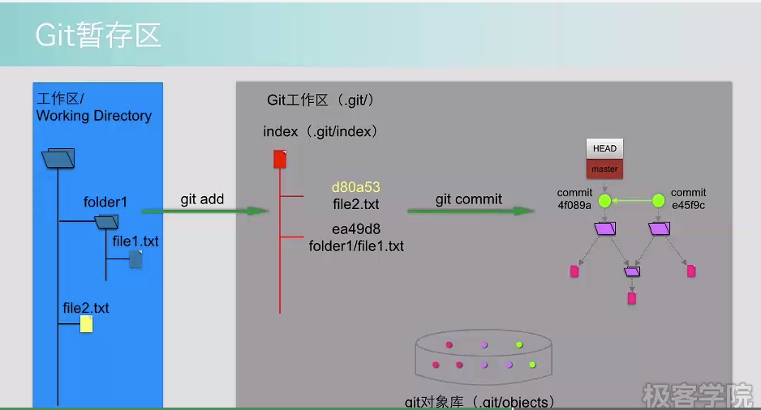
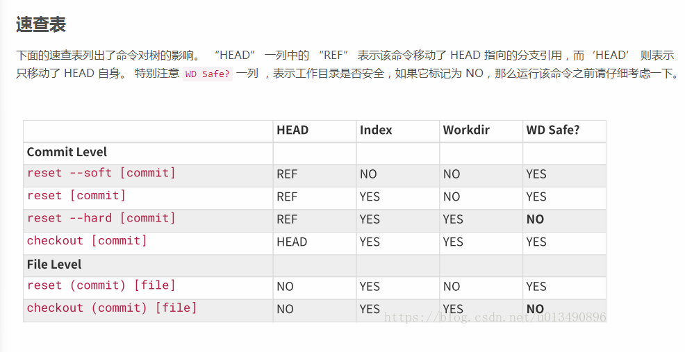
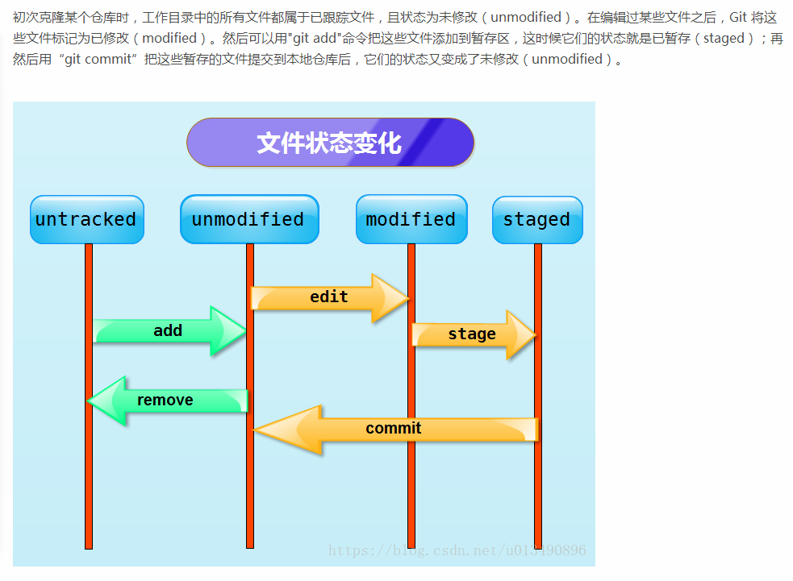
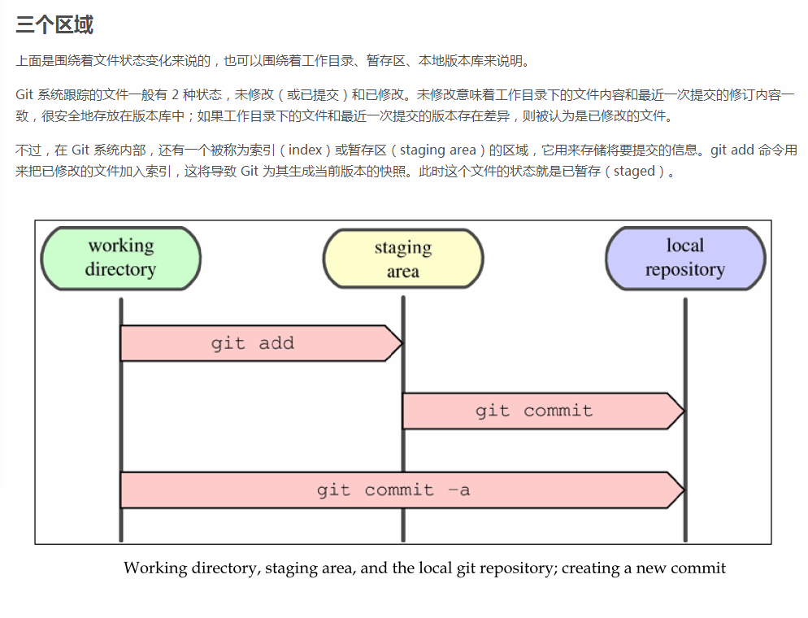
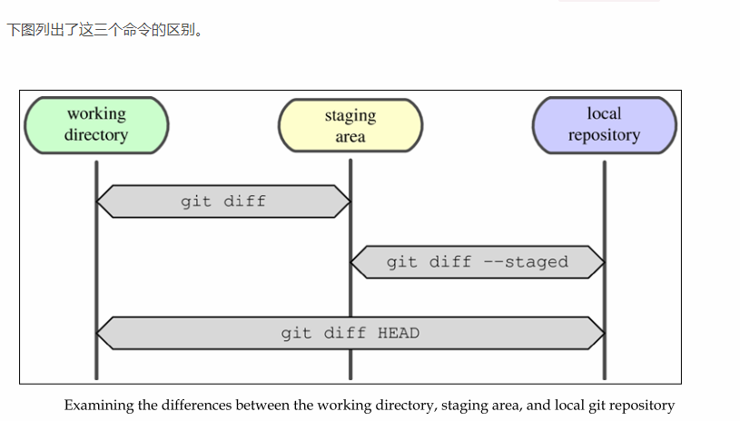
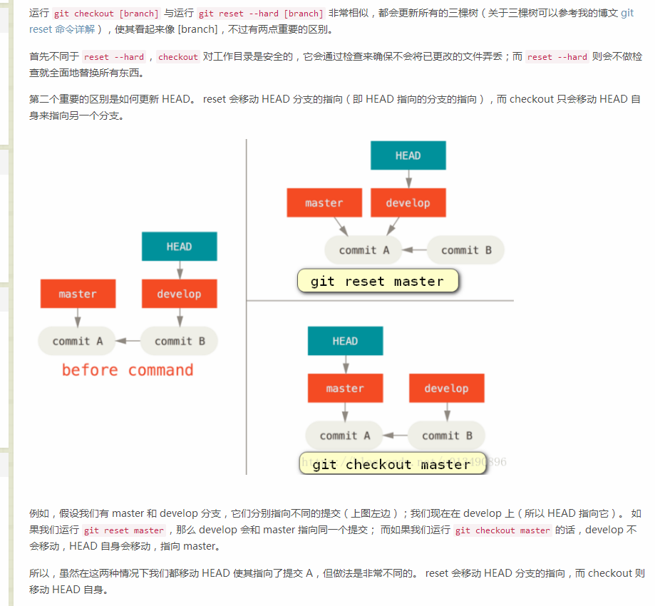
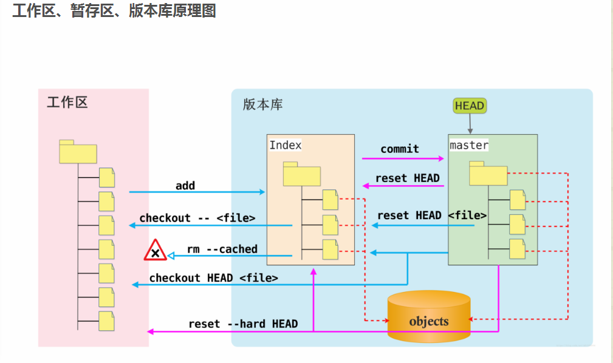

# gittree1

# gittree1

# 速查表

# 文件状态

# diff

# checkout_reset

# 原理图

* 在这个图中，可以看到部分 Git 命令是如何影响工作区和暂存区的。
图中左侧为工作区，右侧为版本库。在版本库中标记为 index 的区域是暂存区。标记为master的是master分支所代表的目录树。
图中可以看出此时HEAD实际是指向master分支的一个“游标”。所以图示的命令中出现HEAD的地方可以用master来替换。
图中的 objects 标识的区域为 Git 的对象库，实际位于 .git/objects目录下。
1. 当对工作区修改（或新增）的文件执行 git add命令时，暂存区的目录树被更新，同时工作区修改（或新增）的文件内容被写入到对象库中的一个新的对象中，而该对象的 ID 被记录在暂存区的文件索引中。
2. 当执行提交操作 git commit 时，暂存区的目录树被写到版本库（对象库）中，master 分支会做相应的更新。即 master 最新指向的目录树就是提交时原暂存区的目录树。
3. 当执行git reset HEAD命令时，暂存区的目录树会被重写，被 master 分支指向的目录树所替换，但是工作区不受影响。
4. 当执行git rm --cached <file>命令时，会直接从暂存区删除文件（可以理解为取消跟踪），工作区则不做出改变。
5. 当执行git checkout -- <file>命令时，会用暂存区指定的文件替换工作区的文件。这个操作很危险，会清除工作区中未添加到暂存区的改动。举例来说：命令git checkout -- readme.txt意思就是把readme.txt文件在工作区的修改全部撤销，这里有两种情况：一是readme.txt自修改后还没有被放到暂存区，现在，撤销修改就回到和版本库一模一样的状态；一种是readme.txt已经添加到暂存区，之后又作了修改，现在，撤销修改就回到添加到暂存区时的状态。
6. 当执行git checkout HEAD 或者 git checkout HEAD <file> 命令时，会用 HEAD 指向的 master 分支中的全部或者部分文件替换暂存区和以及工作区中的文件。注意，前者对工作目录是安全的，Git 会通过检查来确保不会将已更改的文件弄丢；但是后者就危险了，也许会覆盖工作目录中对应的文件！
7. 当执行 git reset HEAD <file> 命令时，它本质上只是将 file 从 HEAD 复制到索引中（可以理解为“取消暂存文件” ）。
8. 当执行 git reset --hard HEAD 时，会用 HEAD 指向的 master 分支中的全部文件替换暂存区以及工作区中的文件。也就是说你撤销了最后的提交（git commit ）、git add 和工作目录中的所有工作，这样做也是危险的，除非你真的想这么做。
9. 也许你会问，git reset --hard HEAD 和 git checkout HEAD 这两个命令有什么区别呢？感觉它们干的事情差不多啊。其实还有很大区别的，具体可以参考我的博文 git checkout 和 git reset 的区别

