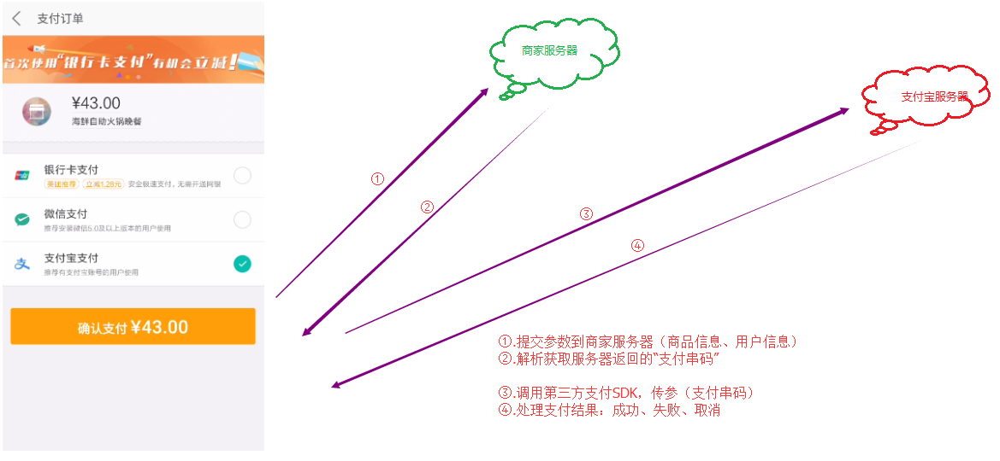
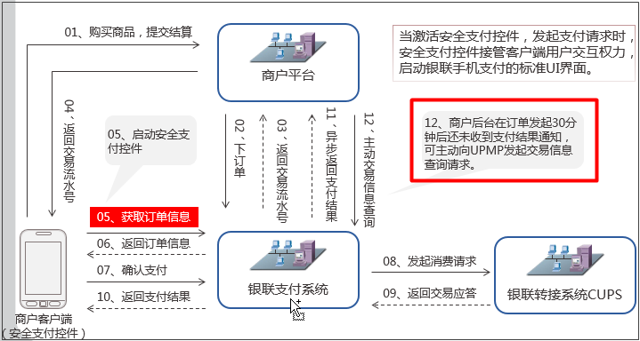
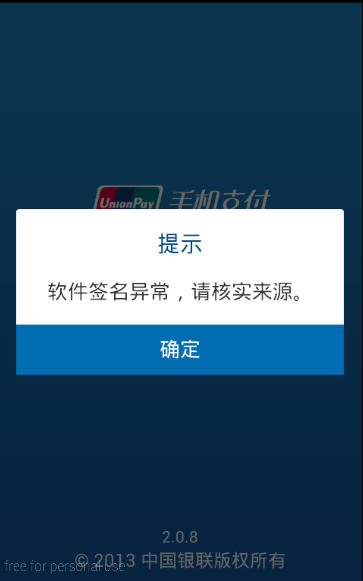
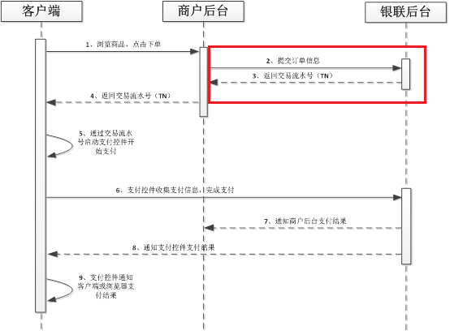
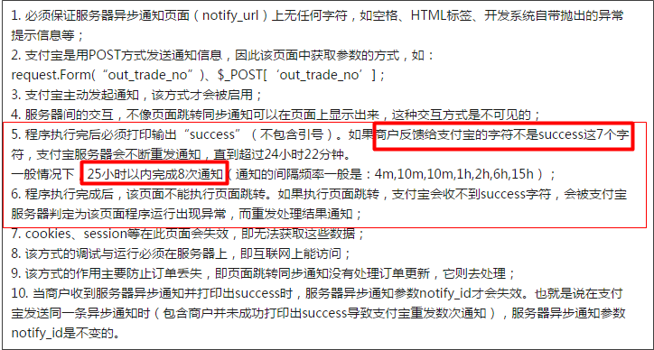
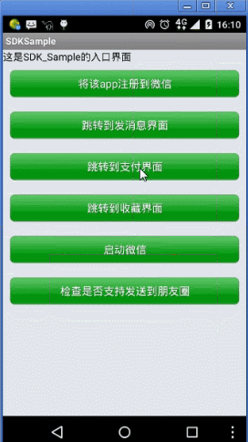

## 第三方支付

### 支付四部曲

* **1.提交参数到服务器**：商品信息（价格、购买数量、商品id）、用户信息（userId）、支付信息（payType，使用了什么支付方式）。助记口诀：谁买了什么东西，用什么支付方式

* **2.解析服务器返回结果**：服务器响应我们提交内容，返回结果，客户端需要解析获取“支付串码”（调用第三方支付平台需要的核心参数）

* **3.调用SDK**：调用第三方支付SDK支付方法，传入支付串码

* **4.处理支付结果**：成功、失败、取消

----------

### 一.银联支付

* 1.[银联支付SDK下载](https://open.unionpay.com/ajweb/help/file/techFile?productId=3)

* 2.开发者平台：[https://open.unionpay.com/ajweb/help/file](https://open.unionpay.com/ajweb/help/file "https://open.unionpay.com/ajweb/help/file")

* 3.异步通知说明：

    * 图片所在路径：**资料\第三方支付平台\银联支付\手机控件支付产品技术开发包3.1.0\手机控件支付产品入网材料\PPT**
    * 
    

* 3.模拟器可能会遇到的错误

* 银联支付测试接口：[http://101.231.204.84:8091/sim/getacptn](http://101.231.204.84:8091/sim/getacptn "http://101.231.204.84:8091/sim/getacptn")

* 3 支付结果处理

	onActivityResult方法中

* 4 支付参数

	交易流水号，是一串数字，数字如何区别是哪个商家的订单？银行如何将该笔交易转账到指定商家？
	请看下面的图：交易流水号是银联生成的，所有银行当然知道是谁的

* 5 支付流程图

----------

### 二.支付宝支付

* 1 开发者平台：[https://doc.open.alipay.com/doc2/alipayDocIndex.htm](https://doc.open.alipay.com/doc2/alipayDocIndex.htm "https://doc.open.alipay.com/doc2/alipayDocIndex.htm")

* 2 异步通知说明：[https://doc.open.alipay.com/doc2/detail.htm?spm=a219a.7629140.0.0.KUnD0S&treeId=59&articleId=103666&docType=1#s1](https://doc.open.alipay.com/doc2/detail.htm?spm=a219a.7629140.0.0.KUnD0S&treeId=59&articleId=103666&docType=1#s1 "支付宝异步通知支付结果")

* 3 异步通知图文：

* 4.[支付宝支付开发者登录入口](https://auth.alipay.com/login/ant_sso_index.htm?goto=https%3A%2F%2Fopenhome.alipay.com%2Fplatform%2FmanageApp.htm)

* 5.[SDK下载](https://doc.open.alipay.com/doc2/detail.htm?treeId=54&articleId=104509&docType=1)

* 6.[支付宝支付状态码](https://doc.open.alipay.com/docs/doc.htm?spm=a219a.7629140.0.0.S07WKC&treeId=193&articleId=105302&docType=1#s2)

* 7.[支付宝参数说明](https://doc.open.alipay.com/docs/doc.htm?spm=a219a.7629140.0.0.IANz0U&treeId=59&articleId=103663&docType=1)

----------

### 三.微信支付

* 运行Demo报错:安全码策略：包名+应用名称+keystore，任何一个参数变化，支付失败

> 解决方案：如果第一次没有使用微信Demo自己的keystore，会报错；改成微信的keystore还是报错，可以清理微信客户端缓冲（注意备份自己的聊天数据），在重新支付就没问题

* **1.微信支付开发者平台**：[https://pay.weixin.qq.com/wiki/doc/api/index.html](https://pay.weixin.qq.com/wiki/doc/api/index.html "https://pay.weixin.qq.com/wiki/doc/api/index.html")

* **2.异步通知文档**：[https://pay.weixin.qq.com/wiki/doc/api/app/app.php?chapter=8_3](https://pay.weixin.qq.com/wiki/doc/api/app/app.php?chapter=8_3 "https://pay.weixin.qq.com/wiki/doc/api/app/app.php?chapter=8_3")

* **3.微信支付很特殊**：keystore签名+包名绑定+应用名称，安全码策略，为了给大家演示微信支付，上课的时候老师使用了微信Demo的包名、应用名称、keystore。到公司肯定使用公司的keystore+包名+应用名称（如何创建提交应用：请看微信支付创建应用视频）

* **4.微信支付测试接口**：[http://wxpay.weixin.qq.com/pub_v2/app/app_pay.php?plat=android](http://wxpay.weixin.qq.com/pub_v2/app/app_pay.php?plat=android "http://wxpay.weixin.qq.com/pub_v2/app/app_pay.php?plat=android")

* **5.微信开发者平台登录入口**：[https://open.weixin.qq.com/](https://open.weixin.qq.com/ "https://open.weixin.qq.com/")

* **6.微信支付签名工具**：[https://open.weixin.qq.com/zh_CN/htmledition/res/dev/download/sdk/Gen_Signature_Android.apk](https://open.weixin.qq.com/zh_CN/htmledition/res/dev/download/sdk/Gen_Signature_Android.apk)

* 7.[微信支付参数生成规则](https://pay.weixin.qq.com/wiki/doc/api/app/app.php?chapter=9_7&index=3)

----------

### 四、集成SDK思路

* 1.要么看集成文档、要么看Demo：Demo+文档的方式集成
* 2.导入资源：jar、so库、asset
* 3.配置清单文件：权限、activity
* 4.调起sdk核心代码

### 五、总结三种支付的区别

- 异步通知：所有第三方支付结果，商家服务器如果想获取支付结果，第三方服务器通知

- 1.银联支付
	- （1）支付串码：交易流水号，一串数字
	- （2）同步返回：客户端直接获取支付结果,onActivityResult方法获取
	- （3）异步通知：客户端给服务器发请求，传递支付结果给服务器？错的，因为客户端通知服务器不可靠，30分钟后如果没有收到支付结果，商家服务器主动向银联服务器请求。
	- （4）支付串码谁生成的：银联服务器生成的

- 2.支付宝支付
	- （1）支付串码:很多参数的字符串，sign（数字签名）、notify_url（异步通知服务器地址）
	- （2）同步返回:客户端直接获取支付结果，handler处理支付结果
	- （3）异步通知：如果商户反馈给支付宝的字符不是success这7个字符，支付宝服务器会不断重发通知，直到超过24小时22分钟
	- （4）支付串码谁生成的：商家服务器生成的，

- 3.微信支付
	- （1）支付串码：核心参数prepayId，预支付订单号
	- （2）同步返回：客户端直接获取支付结果，在WXPayEntryActivity类的onResp方法处理支付结果，包名、类名不能变
	- （3）：异步通知：商家服务器接受到微信通知，必须返回告知
	- （4）支付串码谁生成的：除了prepayId是微信服务器生成，其他都是商家服务器生成
	- （5）安全码策略：包名+应用名+keystore